---
output:
  pdf_document: default
  html_document: default
---
# Introduction
## Events and Probability

```{definition}
Let $\Omega$ be a non-empty set. A **$\sigma$-field** $\mathcal{F}$ on $\Omega$ is a family of subsets of $\Omega$ such that:

- The empty set $\emptyset$ belongs to $\mathcal{F}$;
- If $A$ belongs to $\mathcal{F}$, then so does the complement $\Omega \setminus A$;
- If $A_1, A_2, \ldots$ is a sequence of sets in $\mathcal{F}$, then their union $A_1 \cup A_2 \cup \cdots$ also belongs to $\mathcal{F}$.

```

```{example}
 The family of Borel sets $\mathcal{F}= B(\mathbb{R})$ s a $\sigma$-field on IR. We recall that  $B(\mathbb{R})$ is the smallest $\sigma$-field containing all intervals in $\mathbb{R}$.
```


```{definition}
Let \(\mathcal{F}\) be a \(\sigma\)-field on \(\Omega\). A probability measure \(P\) is a function
\( P : \mathcal{F} \to [0, 1] \)
such that

1. \(P(\Omega) = 1\);
2. if \(A_1, A_2, \ldots\) are pairwise disjoint sets (that is, \(A_i \cap A_j = \emptyset\) for \(i \neq j\)) belonging to \(\mathcal{F}\), then
   \[
   P\left(\bigcup_{i=1}^{\infty} A_i\right) = \sum_{i=1}^{\infty} P(A_i);
   \]

- The triple \((\Omega, \mathcal{F}, P)\) is called a probability space. \\
- The sets belonging to \(\mathcal{F}\) are called events. \\
- An event \(A\) is said to occur almost surely (a.s.) whenever \(P(A) = 1\).

```

```{example}
Let consider,

- \(\Omega=[0, 1]\) with the 
- \(\sigma\)-field =\(\mathcal{F} = \mathcal{B}([0, 1])\) of Borel sets \(B \subseteq [0, 1]\), and 
- Lebesgue measure \(P = \text{Leb}\) on \([0, 1]\). 

Then \((\Omega, \mathcal{F}, P)\) is a probability space. 

Recall that \(\text{Leb}\) is the unique measure defined on Borel sets such that
\[\text{Leb}[a, b] = b - a\]
for any interval \([a, b]\). (In fact, \(\text{Leb}\) can be extended to a larger \(\sigma\)-field, but we shall need Borel sets only.)
```

```{exercise}
Show that if \(A_1, A_2, \ldots\) is an expanding sequence of events, that is
\[ A_1 \subseteq A_2 \subseteq A_3 \subseteq \cdots \]

then
\[ P\left(\bigcup_{n=1}^{\infty} A_n\right) = \lim_{n \to \infty} P(A_n). \]

Similarly, if \(A_1, A_2, \ldots\) is a contracting sequence of events, that is,
\[ A_1 \supseteq A_2 \supseteq A_3 \supseteq \cdots \]

then
\[ P\left(\bigcap_{n=1}^{\infty} A_n\right) = \lim_{n \to \infty} P(A_n). \]

**Hint:** Write \(A_1 \cup A_2 \cup \cdots\) as the union of a sequence of disjoint events: start with \(A_1\), then add a disjoint set to obtain \(A_1 \cup A_2\), then add a disjoint set again to obtain \(A_1 \cup A_2 \cup A_3\), and so on. Now that you have a sequence of disjoint sets, you can use the definition of a probability measure. To deal with the product \(A_1 \cap A_2 \cap \cdots\), write it as a union of some events with the aid of De Morgan's law.

```


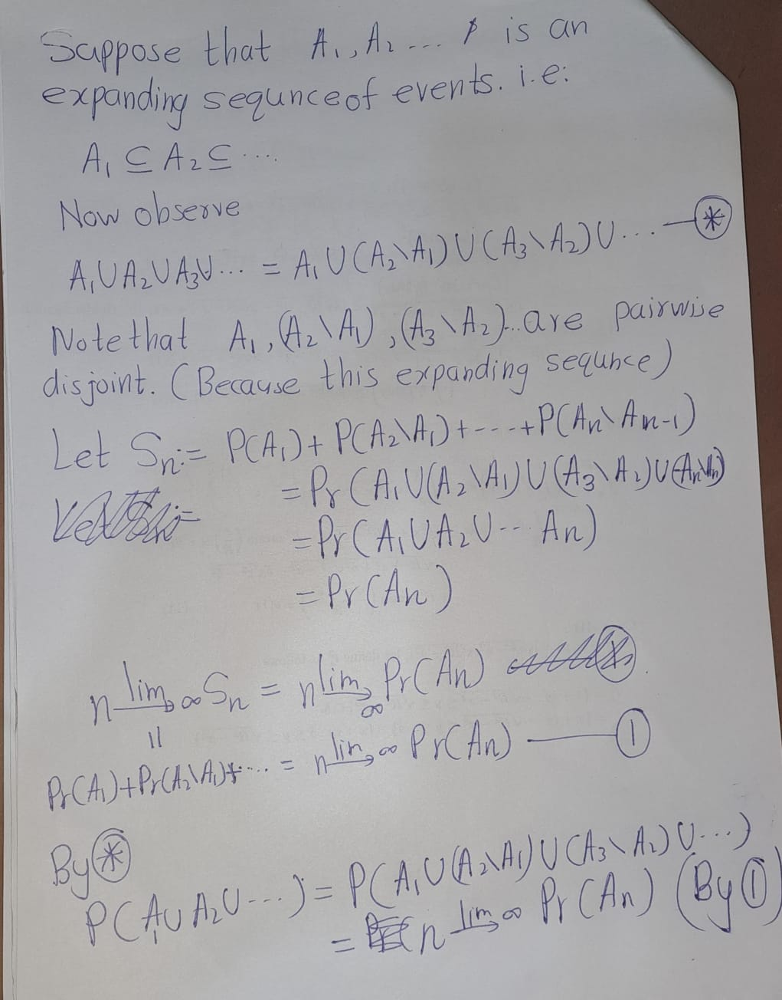{width=18cm}
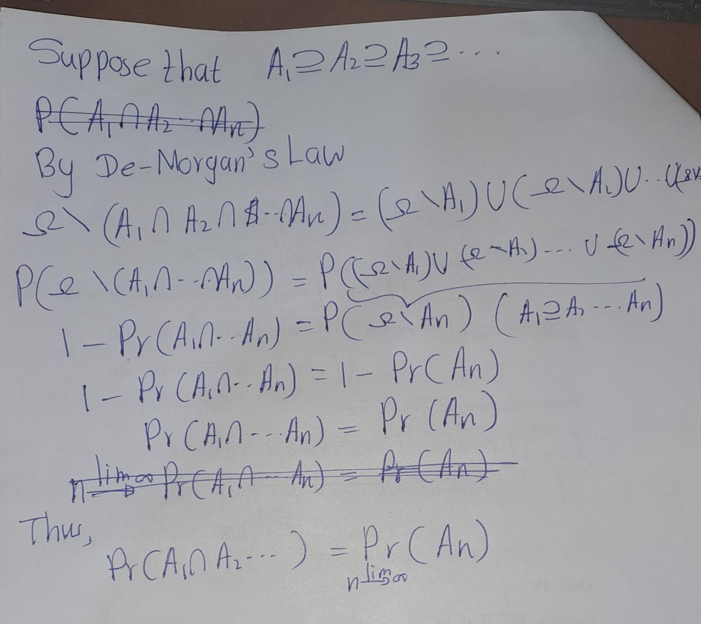{width=18cm}

```{lemma,name='Borei-Cantelli'}
Let \(A_1, A_2, \ldots\) be a sequence of events such that \(P(A_1) + P(A_2) + \cdots < \infty\)
and let \(B_n = A_n \cup A_{n+1} \cup \cdots\). Then \(P(B_1 \cap B_2 \cap \cdots) = 0\).
```

```{exercise}
Prove the Borel-Cantelli lemma above.

**Hint**: \(B_1, B_2, \ldots\) is a contracting sequence of events.
```

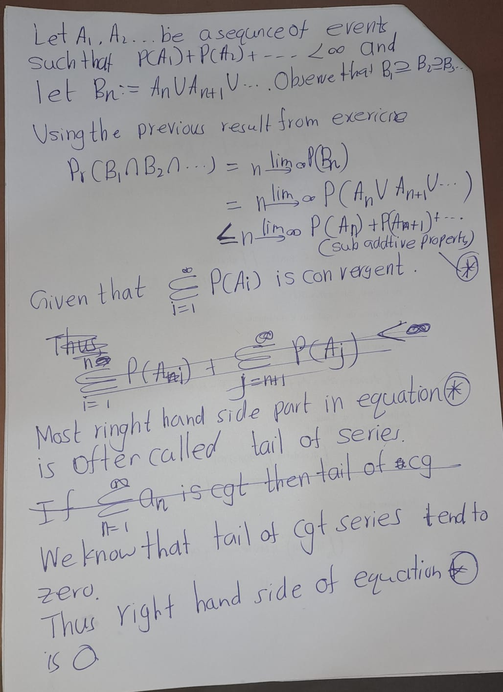{width=18cm}
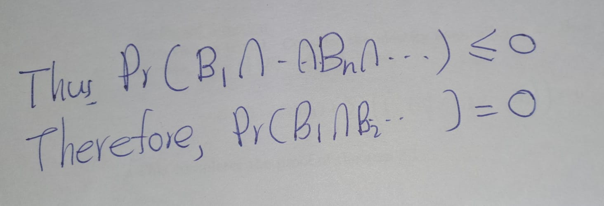{width=18cm}

## Random Variables

```{definition}
If \(\mathcal{F}\) is a \(\sigma\)-field on \(\Omega\), then a function \(X : \Omega \to \mathbb{R}\) is said to be **\(\mathcal{F}\)-measurable** if 
\[\{\omega \in \Omega : X(\omega) \in B\}=X^{-1}(\omega)\]
for every Borel set \(B \in \mathcal{B}(\mathbb{R})\). \
If \((\Omega, \mathcal{F}, P)\) is a probability space, then such a function \(X\) is called a **random variable.**
```

```{definition}
The \(\sigma\)-field **\(\sigma(X)\) generated by a random variable \(X : \Omega \to \mathbb{R}\)** consists of all sets 
of the form \(\{\omega \in \Omega : X(\Omega)\in B\}\), where \(B\) is a Borel set in \(\mathbb{R}\).
```

```{definition}
The \(\sigma\)-field \(\sigma(\{X_i : i \in I\})\) generated  by a family \(\{X_i : i \in I\}\) of random variables 
is defined to be the smallest \(\sigma\)-field containing all events of the form \(\{X_i \in B\}\), 
where \(B\) is a Borel set in \(\mathbb{R}\) and \(i \in I\).
```

```{exercise}
We call \(f : \mathbb{R} \to \mathbb{R}\) a **Borel function** if the inverse image \(f^{-1}(B)\) of any Borel set \(B\) in \(\mathbb{R}\) is a Borel set. Show that if \(f\) is a Borel function and \(X\) is a random variable, then the composition \(f(X)\) is \(\sigma(X)\)-measurable. 

*Hint*: Consider the event \(\{f(X) \in B\}\), where \(B\) is an arbitrary Borel set. Can this 
event be written as \(\{X \in A\}\) for some Borel set \(A\)?
```
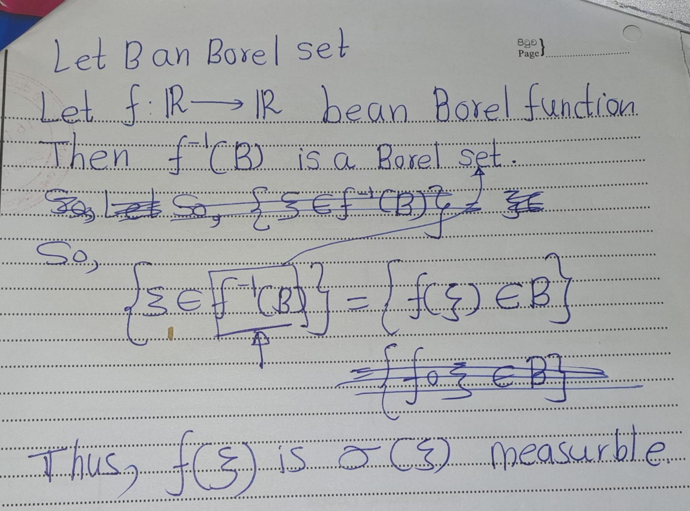{width=18cm}

```{lemma,name='Doob-Dynkin'}
Let \(X\) be a random variable. Then each \(\sigma(X)\)-measurable random variable \(\eta\) can 
be written as 
\[
\eta = f(X)
\]
for some Borel function \(f : \mathbb{R} \to \mathbb{R}\).

```

```{proof}
Omiited
```

```{definition}
Every random variable \(X : \Omega \to \mathbb{R}\) gives rise to a probability measure 
\[ P_X(B) = P\{X \in B\} \]
on \(\mathbb{R}\) defined on the \(\sigma\)-field of Borel sets \(B \in \mathcal{B}(\mathbb{R})\). We call \(P_X\) the distribution 
of \(X\). The function \(F_X : \mathbb{R} \to [0, 1]\) defined by 
\[ F_X(x) = P\{X \leq x\} \]
is called the cumulative distribution function (CDF) of \(X\).

```

```{exercise}
Show that the distribution function $F$ is non-decreasing, right-continuous, and 
\[
\lim_{x \to -\infty} F_{\xi}(x) = 0, \quad \lim_{x \to +\infty} F_{\Xi}(x) = 1.
\]

\textbf{Hint:} For example, to verify right-continuity show that $F_{\xi}(x_n) \to F_{\xi}(x)$ for any decreasing sequence $x_n$ such that $x_n \to x$. You may find the results of Exercises useful.
```
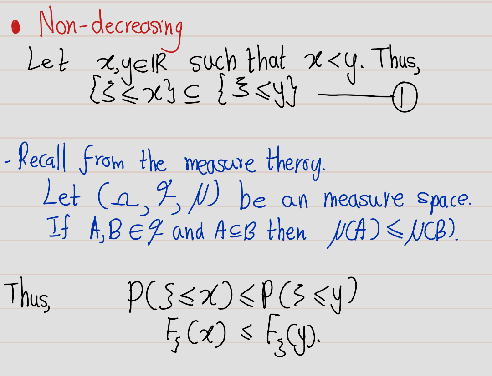{width=18cm}
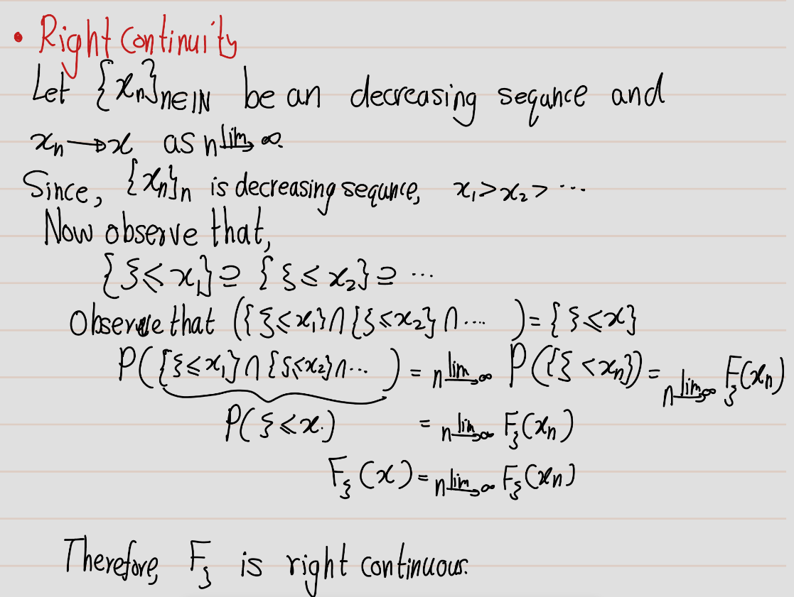{width=18cm}
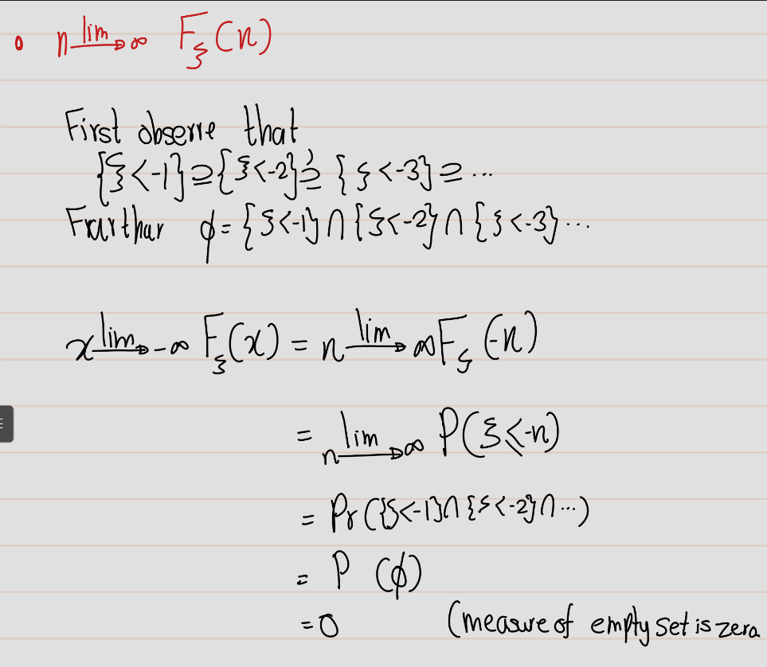{width=18cm}
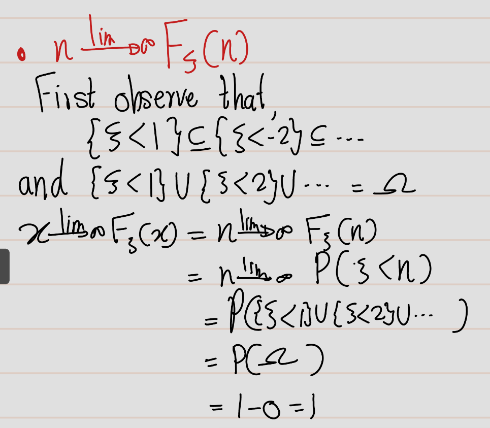{width=18cm}


```{definition}
If there is a Borel function $f: \mathbb{R} \to \mathbb{R}$ such that for any Borel set $B \subset \mathbb{R}$ 
\[
P\{\xi \in B\} = \int_B f_\xi(x) \, dx,
\]
then $\xi$ is said to be a random variable with absolutely continuous distribution and $f_\xi$ is called the **density of $\xi$**. If there is a (finite or infinite) sequence of pairwise distinct real numbers $x_1, x_2, \ldots$ such that for any Borel set $B \subset \mathbb{R}$ 
\[
P\{\xi \in B\} = \sum_{x_i \in B} P\{\xi = x_i\},
\]
then $\xi$ is said to have a discrete distribution with values $x_1, x_2, \ldots$ and mass $P\{\xi = x_i\}$ at $x_i$.
```

```{exercise}
Suppose that $\xi$ has a continuous distribution with density $f$. Show that 
$f$ is continuous at $x$. 

\textbf{Hint:} Express $F(x)$ as an integral of $f$.
```
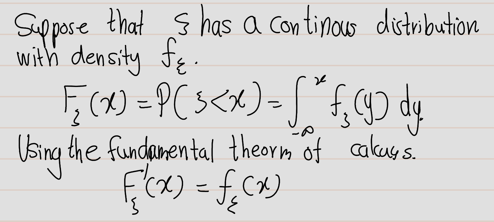{width=18cm}

Show that if \(\xi\) has discrete distribution with values \(x_1, x_2, . . . ,\) then \(F_\xi\) is 
constant on each interval (s, t] not containing any of the x_i's and has jumps of size P {\xi= x_i} at each x_i· 
Hint The increment Fe ( t) - Fe ( s ) is equal to the total mass of the Xi's that belong to the interval [s, t).

{width=18cm}


```{definition}
The **joint distribution** of several random variables \(\xi_1, \ldots, \xi_n\) is a probability measure \(P_{\xi_1, \ldots, \xi_n}\) on \(\mathbb{R}^n\) such that
\[P_{\xi_1, \ldots, \xi_n}(B)=P\left\{\xi_1, \ldots, \xi_n\in B\right\}\]
for any Borel set \(B\) in \(\mathbb{R}^n\). If there is a Borel function \(f_{\xi_1, \ldots, \xi_n} : \mathbb{R}^n \to \mathbb{R}\) such that

\[ P\{(\xi_1, \ldots, \xi_n) \in B\} = \int_B f_{\xi_1, \ldots, \xi_n}(x_1, \ldots, x_n) \, dx_1 \cdots dx_n \]

for any Borel set \(B\) in \(\mathbb{R}^n\), then \(f_{\xi_1, \ldots, \xi_n}\) is called the **joint density** of \(\xi_1, \ldots, \xi_n\).

```

```{definition}
A random variable \(\xi : \Omega \to \mathbb{R}\) is said to be **integrable** if 

\[ \int_\Omega |\xi| \, dP < \infty. \]

The integral 

\[ \mathbb{E}(\xi) = \int_\Omega \xi \, dP \]

exists and is called the expectation of \(\xi\). The family of integrable random variables \(\xi : \Omega \to \mathbb{R}\) will be denoted by \(L^1\) or, in case of possible ambiguity, by \(L^1(\Omega, \mathcal{F}, P)\).
```


```{example}
The **indicator function** \(\mathbf{1}_A\) of a set \(A\) is equal to 1 on \(A\) and 0 on the complement \(\Omega \setminus A\) of \(A\). 
i.e.:
\[1_A(a):=\begin{cases} 1 & \text{ if } a \in A  \\0 & \text{ if } a \not\in A\end{cases}  \]
  
For any event \(A\), 
\[\mathbb{E}[1_A]=\int_\Omega 1_A dP=P(A)\]

we say that \(\eta : \Omega \to \mathbb{R}\) is a step function if 

\[ \eta = \sum_{i=1}^n \eta_i \mathbf{1}_{A_i}, \]

where \(\eta_1, \ldots, \eta_n\) are real numbers and \(A_1, \ldots, A_n\) are pairwise disjoint events. Then,
\[\mathbb{E}[\eta]=\int_\Omega \eta dP=\sum_{i=1}^n\eta_i \int_\Omega 1_{A_i} dP=\sum_{i=1}^n \eta_i P(A_i)\]

```

```{exercise}
Show that for any Borel function \( h : \mathbb{R} \to \mathbb{R} \) such that \( h(X) \) is integrable, 
\[ \mathbb{E}(h(X)) = \int h(x) \, dP_X(x). \]

\textbf{Hint:} First verify the equality for step functions \( h : \mathbb{R} \to \mathbb{R} \), then for non-negative ones by approximating them by step functions, and finally for arbitrary Borel functions by splitting them into positive and negative parts
```


**More to go**
...

## Conditional Probability and Independence

```{definition}
For any events \( A, B \in \mathcal{F} \) such that \( P(B) \neq 0 \), the conditional probability of \( A \) given \( B \) is defined by
\[P(A \mid B) = \frac{P(A \cap B)}{P(B)}\]
```

```{exercise}
Prove the **total probability formula** for any event \( A \in \mathcal{F} \) and any sequence of pairwise disjoint events \( B_1, B_2, \ldots \in \mathcal{F} \) such that \( B_1 \cup B_2 \cup \cdots = \emptyset \) and \( P(B_n) \neq 0 \) for any \( n \).

**Hint**: \( A = (A \cap B_1) \cup (A \cap B_2) \cup \cdots \)
```
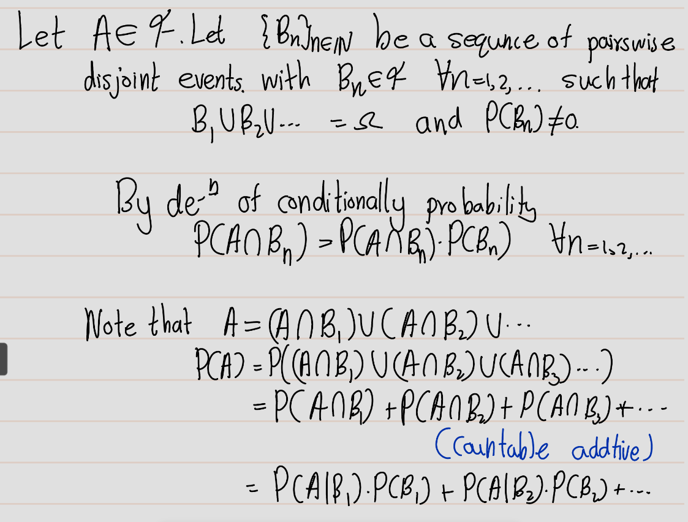{width=18cm}

```{definition}
Two events \( A, B \in \mathcal{F} \) are called **independent** if 
\[
P(A \cap B) = P(A)P(B).
\]
In general, we say that \( n \) events \( A_1, \ldots, A_n \in \mathcal{F} \) are **independent** if for any indices \( 1 \leq i_1 < i_2 < \cdots < i_k \leq n \),
\[
P(A_{i_1} \cap A_{i_2} \cap \cdots \cap A_{i_k}) = P(A_{i_1})P(A_{i_2}) \cdots P(A_{i_k}).
\]
```

```{exercise}
Let \( P(B) \neq 0 \). Show that \( A \) and \( B \) are independent events if and only if 
\[
P(A \mid B) = P(A).
\]
\textbf{Hint:} If \( P(B) \neq 0 \), then you can divide by it.
```

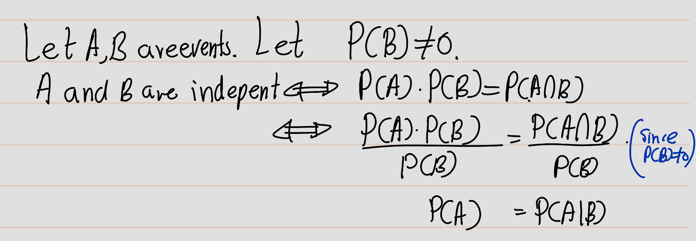{width=18cm}

```{definition}
Two random variables \( \xi \) and \( \eta \) are called independent if for any Borel sets \( A, B \in \mathcal{B}(\mathbb{R}) \), the two events 
\[
\{ \xi \in A \} \text{ and } \{ \eta \in B \}
\]
are independent. 

We say that \( n \) random variables \( \xi_1, \ldots, \xi_n \) are independent if for any Borel sets \( B_1, \ldots, B_n \in \mathcal{B}(\mathbb{R}) \), the events 
\[
\{ \xi_1 \in B_1 \}, \{ \xi_2 \in B_2 \}, \ldots, \{ \xi_n \in B_n \}
\]
are independent. 

In general, a (finite or infinite) family of random variables is said to be independent if any finite number of random variables from this family are independent.
```

```{proposition}
If two integrable random variables \( \xi, \eta : \Omega \to \mathbb{R} \) are independent, then they are uncorrelated, i.e.,
\[
E(\xi \eta) = E(\xi) E(\eta),
\]
provided that the product \( \xi \eta \) is also integrable. 

If \( \xi_1, \ldots, \xi_n : \Omega \to \mathbb{R} \) are independent integrable random variables, then
\[
E(\xi_1 \xi_2 \cdots \xi_n) = E(\xi_1) E(\xi_2) \cdots E(\xi_n),
\]
provided that the product \( \xi_1 \xi_2 \cdots \xi_n \) is also integrable.
```

```{definition}
Two \(\sigma\)-fields \( \mathcal{G} \) and \( \mathcal{H} \) contained in \( \mathcal{F} \) are called independent if any two events \[ A \in \mathcal{G} \text{ and }   B \in \mathcal{H} \] are independent. 

Similarly, any finite number of \(\sigma\)-fields \( \mathcal{G}_1, \ldots, \mathcal{G}_n \) contained in \( \mathcal{F} \) are independent if any \( n \) events \[ A_1 \in \mathcal{G}_1, \ldots, A_n \in \mathcal{G}_n \] are independent. 

In general, a (finite or infinite) family of \(\sigma\)-fields is said to be independent if any finite number of them are independent.
```

```{exercise}
Show that two random variables \( \xi \) and \( \eta \) are independent if and only if the \(\sigma\)-fields \( \sigma(\xi) \) and \( \sigma(\eta) \) generated by them are independent.

\textbf{Hint:} The events in \( \sigma(\xi) \) and \( \sigma(\eta) \) are of the form \( \{\xi \in A\} \) and \( \{\eta \in B\} \), where \( A \) and \( B \) are Borel sets.
```
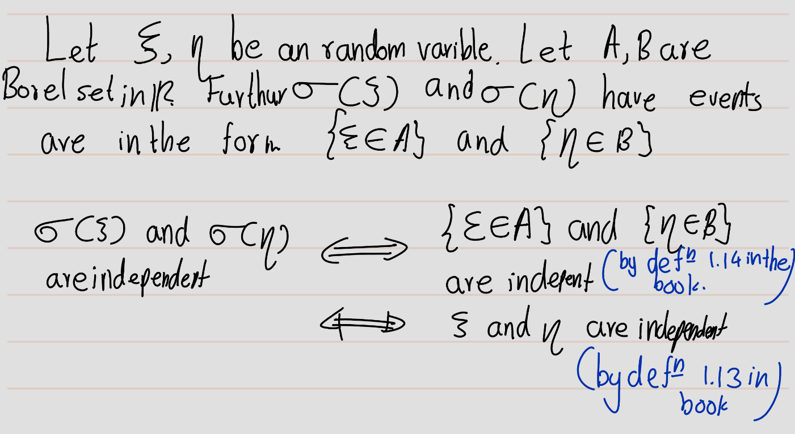{width=18cm}

Sometimes it is convenient to talk of independence for a combination of random variables and \(\sigma\)-fields.

```{definition}
We say that a random variable \( \xi \) is independent of a \(\sigma\)-field \( \mathcal{G} \) if the \(\sigma\)-fields \[ \sigma(\xi) \text{ and } \mathcal{G} \] are independent. This can be extended to any (finite or infinite) family consisting of random variables or \(\sigma\)-fields or a combination of them both. Namely, such a family is called independent if for any finite number of random variables \( \xi_1, \ldots, \xi_m \) and \(\sigma\)-fields \( \mathcal{G}_1, \ldots, \mathcal{G}_n \) from this family, the \(\sigma\)-fields 
\[\sigma(\xi_1),...,\sigma(\xi_m),\mathcal{G}_1,..,\mathcal{G}_n\]
are independent.
```

