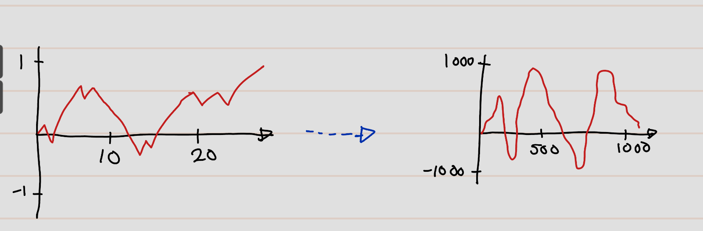

# Random Walk to Brownier Motion.
Slandered approach model stochastic  dynamic in discrete time.

Let \(\eta_i\) be an random variable on a conman probability space.
We often \(\Omega,\mathcal{F},P\) assume that i.i.d. This case \(\eta _i\) is called white noise, otherwise coloured noise.
Now we have definite dynamics. It will be given as discreate time dynamical systems recursively by some non linear function.
We define, 
\begin{equation}
X_{n+1}=X_n+\phi_{n+1}(X_n,\eta_{n+1}) \quad n=0,1,2,...(\#eq:1)
\end{equation}

where \(\phi_n:\mathbb{R}^d\times \mathbb{R}^d\to \mathbb{R}^d\) are measurable. Further, if $X_0$ and $\eta_0$ are all independent then $X_n$ is called **Markov Chain**.

Now let $\eta_i$ be i.i.d and defineda random walk

\begin{align}
S_n&:=\sum_{i=1}^n \eta_i\\
S_{(n+1)}&:=S_n+\eta_{(n+1)}
\end{align}

We can rewrite  \@ref(eq:1) as
\[X_{n+1}-X_n=\phi_{n+1}(X_n,S_{n+1}-S_n)\quad n=0,1,...\]

This equation is called _Stochastic  difference equations_.

**AIM**: Develop a continuous time analogous.

**Question** What to use an contionus time replacement of the random walks?

```{definition}
Let \(I\) be index set \((I=\mathbb{N} \text{ or } I=\mathbb{R}^+)\). A collection of random varibels \((X_t)_{i\in I}\) on \((\Omega,\mathcal{F},P)\) is called staocastic process.
```

 We need \(I\) to be a just totally ordered set for convention of time. If it is not an totally ordered set it is not a stochastic process but a random field.
 
Now we need a notation of a filtration.

```{definition}
Le \(\mathcal{F}_t\) be non-decreasing sequnce of sub sigma algbers of \(\mathcal{F}\) (i.e. \(\mathcal{F}_s\subseteq \mathcal{F}_t\) for all \(s\geq t, s,t\in \in I\)), then \((\mathcal{F}_t)_{t\in I}\) is called a filtration.
```
Last we need the notation adaptness.

```{definition}
A stocticstic process \(X_t\) is called adapted to filteration \((\mathcal{F}_t)_t\) if \(X_t\in \mathcal{F}_t\). i.e: $X_t$ is measurable
```

```{theorem,name='Central Limit Theorem'}
Let $Y_{n_i}:\Omega \to \mathbb{R}^d$ (be collection of random varibles), \(1\leq i \leq n < \infty\) be identical distributed and square intergable random varaible on \((\Omega,\mathcal{F},P)\) such that \(Y_{n_1},Y_{n_2},...,Y_{n_n}\) are independent for all \(n\in \mathbb{N}\). Then
\[\left(\frac{1}{\sqrt{n}}\sum_{i=1}^n Y_{n_i}-\mathbb{E}[Y_i] \right)
  \xrightarrow{\mathcal{D}} N(0,C) \text{ as } n \to \infty\],
where\(N(0,C)\) is multivarible noremal distribution with covarice matrix \[Y_{k,l}=Cov[Y^{(k)}_{n_i} -Y^{(l)}_{n_i}]\]

and\(\xrightarrow{\mathcal{D}}\) means "distribution is convergent" to ```
```{proof}
Omitted
```
We consider the random walk
\[S_n=\sum_{i=1}^n\eta_i\]
with \(\eta_i\in L^2(\Omega,\mathcal{F},P)\) and normalized.(i.e. \(\mathbb{E}[\eta_i]=0,Var[\eta_i]=1\))

**Plotting** (Linear Interpolation)

This gives an idea about the existance of a scaling limit. Now a question might be rising.

**Question**: What is right rescaling?

That is  we try to define a rescaled random walk \(S^m_t\)(Here superscipt \(m\) is for mesh size),
\((t=0,\frac{1}{m},\frac{2}{m},cdots)\) with step-size \(\frac{1}{m}\)
\[S_{\frac{k}{m}}^{(m)}=c_mS_k\]
Here \(here c_m\) is rescaling constant. It is difficulit to correct \(c_m\), because unless it decay so fast at the end you convert to zero or blow up whole thing and goes to infinity.

For \(t=\frac{k}{m}\) we have
\[Var[S_t^{(m)}]=c^2_m\]