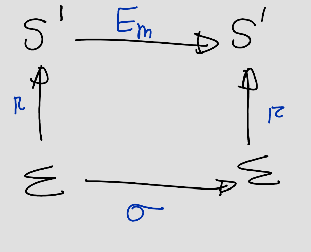

# Stochastic and Dynamics

## Discrete Dynamical Systems

```{example}
- 3-body problem (Lyapunov and Poincaré)
- Kolmogorov Systems
```

```{definition}
A discrete dynamical system consists of a non-empty set $X$ and a map $f: X \to X$.

**Notation**: $(X,f)$
```

```{proposition}
- If $f$ is invertible, then $(\{f^n\}, \circ)$ is a group.
- If $f$ is non-invertible, then $(\{f^n\}, \circ)$ is a semi-group. 
```

## A Class of Problems

The problem of finding "good" estimates for parameters, features, and states of dynamical systems arises in many applications.

Consider the process $(X_n, Y_n)$, where:
- $X_n$ is the current state.
- $Y_n$ is the observation.

| $X_n$ / $Y_n$ | Noise               | No-Noise             |
|---------------|---------------------|----------------------|
| Noise         | State space model   | Markov model         |
| No-Noise      | $f: X \to X$, $X_n = f^n(x_0)$, $Y_n=g(X_n)+\bar{\varepsilon}$, where $\bar{\varepsilon} \sim N(0,1)$ | Ergodic model, $f: X \to X$, $X_n = f^n(x_0)$, $Y_n=g(X_n)$ |

```{definition,name='Orbit'}
- If $f$ is invertible, then
$$
\text{positive orbit of } x := O_f^+ = \{f^n(x) : n = 0, 1, 2, \dots\}
$$
$$
\text{negative orbit of } x := O_f^- = \{f^{-n}(x) : n = 0, 1, 2, \dots\}
$$
Then
$$
\text{Orbit of } x = O_f := O_f^+ \cup O_f^-.
$$

- If $f$ is non-invertible, then
$$
\text{orbit of } x := O_f = O_f^+ = \{f^n(x) : n = 0, 1, 2, \dots\}.
$$
```

<center>
{width=50%}
</center>

```{definition}
- The orbit of a periodic point is called a **periodic orbit**.
- If the period is 1, then that point is called a **fixed point**.
- A point $x$ is called **eventually periodic** if there exists $n_0$ such that $f^{n_0}(x)$ is periodic. \
In other words, there exists $\bar{N}$ such that $f^{\bar{N}}(f^{n_0}(x)) = f^{n_0}(x)$.
```

<center>
{width=50%}
</center>


```{exercise}
Show that if $f$ is invertible, then all eventually periodic points are periodic.
```

```{proof}
Suppose that $f$ is invertible. 
Let $x$ be an eventually periodic point. Then there exist $n_0 \geq 0$ and $p > 0$ such that:
\[
f^p(f^{n_0}(x)) = f^{n_0+p}(x) = f^{n_0}(x).
\]

Since $f$ is invertible, 
\[
\begin{align}
f^{-n_0}(f^{n_0+p}(x)) &= f^{-n_0}(f^{n_0}(x))\\
f^{-n_0+n_0+p}(x) &= f^{-n_0+n_0}(x)\\
f^{p}(x) &= x.
\end{align}
\]
```

**Fact**: $A \subseteq f^{-n}(f^n(A))$

```{definition,name='Invariance'}
We say that $A$ is $f$-invariant if $f^{-1}(A) = A$, \
here $f^{-1}(A) =$ preimage of $A$ under the map $f$, i.e., $\{x \in X \mid f(x) \in A\}$. 
```

```{exercise}
Assume that $f$ is invertible. Can you think of a non-trivial invariant set $(X,f)$?
Here, trivial invariant sets are the empty set and the whole set.
```

If there exists $x_0$, $O_f(x_0) \neq X$, then $O_f(x_0)$ is a non-trivial $f$-invariant set.


```{definition}
Let \( (X, f), (Y, g) \) be two discrete dynamical systems. \( \pi: Y \to X \) is called a **semi-conjugacy** if \( f \circ \pi = \pi \circ g \)  and \(\pi\) is surjective.

```

<center>
{width=30%}
</center>

```{definition}
If $\pi$ is invertible then $\pi$ is called **conjugacy**.
```

## Examples

Now let's see some examples.

```{example,name='Circle Rotaions'}
\[
R_\alpha = x + \alpha \pmod{1} = x + \alpha - \lfloor x + \alpha \rfloor
\]
This removes the integer part.
```


Let $$d(x,y)=\min\{|x-y|,1-|x-y|\}$$. Then $(S^1,d)$ is a complete metric space.

```{proof}
Later Try it.
```

```{exercise}
If $\alpha\in \mathbb{Q}$  all orbits are periodic.
```

```{proof}
If $\alpha\in \mathbb{Q}$ then $\alpha+\frac{p}{q}$ for some $p,q\in \mathbb{Z}$.

If \( x_0 = x \), consider the iterates:
   \[
   x_1 = R_\alpha(x_0) = x_0 + \frac{p}{q} \pmod{1},
   \]
   \[
   x_2 = R_\alpha(x_1) = x_0 + 2\frac{p}{q} \pmod{1},
   \]
   and so on, producing the sequence \( x_n = x_0 + n\frac{p}{q} \pmod{1} \).

   
Beacuse,  \( \alpha = \frac{p}{q} \) is rational, the sequence \( x_n \) will eventually return to its starting point after at most \( q \) steps. This follows from the periodicity of \( R_\alpha(x) \), as the fractional parts of \( n \frac{p}{q} \mod 1 \) take on at most \( q \) distinct values.

Thus, the map \( R_\alpha(x) \) is periodic if \( \alpha \) is rational.

```

```{exercise}
If $\alpha\in \mathbb{R}\setminus \mathbb{Q}$  then $\overline{O^+_{R_\alpha}(x)}=S^1$.
```


```{proof} 
Fix any choice of \( x \in S^1 \) and \( \varepsilon > 0 \).

By the pigeonhole principle, there exist integers \( 0 \leq l < k \leq \lceil 1 / \varepsilon \rceil \) such that:
\[
d(T^k(x), T^l(x)) < \varepsilon,
\]
where \( d \) is the natural metric on \( S^1 \).

Since applying \( T^l \) preserves distances, this implies:
\[
d(x, T^{k-l}(x)) < \varepsilon.
\]

Denote \( m = k - l \). Clearly, the orbit:
\[
\{T^n(x) \mid n \in \mathbb{Z}\}
\]
is contained within:
\[
\{x, T^m(x), T^{2m}(x), \ldots\}.
\]

Furthermore, this latter set is \( \varepsilon \)-dense in \( S^1 \), as \( \alpha \in \mathbb{R} \setminus \mathbb{Q} \) ensures that the orbit does not repeat and fills the circle densely.

Thus, the closure of the forward orbit is:
\[
\overline{O^+_{R_\alpha}(x)} = S^1.
\]
```

```{exercise}
Find the all closed subsets of $R_\alpha$, where $\alpha$ is irrational.
```

```{example}
Let $m\in \mathbb{N}, m>1$.Define,
\[
\begin{align}
E_m:S^1 & \to S^1\\
x& \mapsto mx \pmod{1}
\end{align}
\]
```
- If $m=2$,


- If $m=3$,


Unlike $R_\alpha$ is "expanding".

```{definition}
An exapnding map $f$ on a metric space $(X,d)$ is ampa that expandss distance between nearby points.
i.e.: \[
d(x,y)<\varepsilon \implies d(f(x),f(y))>\lambda d(x,y) \text{ for some \lambda >1}
  \]
```

**Claim**: $E_m$ is preserves Lebesgue measure on $S^1$.
i.e: 
\[
\text{Leb}(E^{-1}_m(A))=\text{Leb}(A) \text{ for all measureble set } A.
\]

```{exercise}
Let $E_{10}(x)=10x\pmod{1}$.

a. Show that $E_10$. has periodic orbits of all periodic.
a. Show that there exist $O^+_{10}(x)=S^1$.
a. Show that the set of periodic points $E_10$ are dense $S^1$.
```

Now fix $m>1$. Let 

\[
\begin{align}
\Sigma &= \{0, 1, \ldots, m-1\}^\mathbb{N} \\
&= \{(x_k)_{k=1}^\infty \mid x_k \in \{0, 1, \ldots, m-1\} \text{ for all } k \in \mathbb{N}\} \\
&= \text{the set of sequences with coefficients in } \{0, 1, \ldots, m-1\}.
\end{align}
\]


Define \[\
\begin{align}
\sigma: \Sigma &\to \Sigma\\
(x_1,x_2,...) &\mapsto (x_2,x_3,...)
\end{align}
\]

<center>
{width=50%}
</center>


\[
\Pi ((x_k)_{k=1}^\infty)=\sum_{k=1}^\infty \frac{x_k}{m^k}
\]


```{exercise}
Verify this conjugacy.
```

The natural topology on $\{0, 1, \ldots, m-1\}$ is the discrete topology. Basic open sets in the discrete topology consist of individual letters; thus, the open cylinders of the product topology on $\{0, 1, \ldots, m-1\}^{\mathbb{N}}$ are 
\[
C_l^k = \{x \in \{0, 1, \ldots, m-1\}^{\mathbb{N}} : x_k = l\}.
\]

Cylinder that generate product topology on $\Sigma$.The intersections of a finite number of open cylinders are the cylinder sets,

\[
\begin{aligned}
C^{k_1,\ldots,k_r}_{l_1,\ldots,l_r} &= C_{k_1}^{l_1} \cap C_{k_2}^{l_2} \cap \cdots \cap C_{k_r}^{l_r} \\
&= \{(x_k)_{k=0}^\infty \mid x_{k_1} = l_1, \ldots, x_{k_r} = l_r\}.
\end{aligned}
\]


Define metric 
\[
d(x_n,y_n)=2^{-l}, \text{ here } l=\min\{n\mid y_n\neq x_n\}
\]
Then \(B_(x_n,2^{-l})=C^{k_1,\ldots,k_r}_{l_1,\ldots,l_r} \)

```{exercise}
Verify.
```

```{example,name='logistic family'}
\[
\begin{aligned}
q_\mu:[0,1] & \to [0,1]\\
x & \mapsto \mu x (1-x)
\end{aligned}
\]
```


```{theorem,name='Strong Law of Large Numbers(SLLN)'}
Let \(X\) be a real-valued random variable, and let \(X_1, X_2, X_3, \ldots\) be an infinite sequence of independent and identically distributed copies of \(X\). Let 

\[
\overline{X}_n := \frac{1}{n}(X_1 + \ldots + X_n)
\]

be the empirical averages of this sequence. A fundamental theorem in probability theory is the law of large numbers.
Suppose that the first moment of \(X\) is finite (\(\mathbb{E}[X]<\infty\)). Then \(\overline{X}_n\) converges almost surely to \(\mathbb{E}[X]\), thus

\[
\mathbb{P}\left(\lim_{n \to \infty} \overline{X}_n = \mathbb{E}[X]\right) = 1.
\]
```


```{example,name='Coin Flips'}
Consider a fair coin, where the probability of getting heads (\(H\)) is \(p = 0.5\) and the probability of getting tails (\(T\)) is \(1 - p = 0.5\). Let \( X_i \) represent the outcome of the \(i\)-th coin flip, where:
\[
X_i = 
\begin{cases} 
1 & \text{if the outcome is heads (H)}, \\
0 & \text{if the outcome is tails (T)}.
\end{cases}
\]

The expected value of each \(X_i\) is:

\[
\mathbb{E}[X_i] = 1 \cdot 0.5 + 0 \cdot 0.5 = 0.5.
\]

Let \( \overline{X}_n \) represent the sample mean after \(n\) flips, i.e.,

\[
\overline{X}_n = \frac{1}{n} \sum_{i=1}^{n} X_i.
\]

By the Strong Law of Large Numbers (SLLN), as the number of flips \(n\) increases, the sample mean \( \overline{X}_n \) will converge almost surely to the expected value \( \mathbb{E}[X_i] = 0.5 \). This means:

\[
\mathbb{P}\left( \lim_{n \to \infty} \overline{X}_n = \frac{1}{2} \right) = 1.
\]

```

## Measure Theory A crash Course.


```{definition,name='sigma-algebra'}
Consider a set \( X \).
A \( \sigma \)-algebra \( \mathcal{A} \) of subsets of \( X \) is a collection \( \mathcal{A} \) of subsets of \( X \) (\( \mathcal{A} \subseteq \mathcal{P}(X)=\)Power set of \(X\))satisfying the following conditions:

- \( \emptyset \in \mathcal{A} \)
- If \( A \in \mathcal{A} \), then its complement \( A^c \) is also in \( \mathcal{A} \)
- If \( A_1, A_2, \dots \) is a countable collection of sets in \( \mathcal{A} \), then their union \( \bigcup_{n=1}^{\infty} A_n \) is also in \( \mathcal{A} \)
```

```{definition,name='measure'}
Let \( X \) be a set and \( \Sigma \) a \( \sigma \)-algebra over \( X \). A set function \( \mu \) from \( \Sigma \) to the extended real number line is called a measure if the following conditions hold:


- \textbf{Non-negativity:} For all \( E \in \Sigma \), \( \mu(E) \geq 0 \).
- \( \mu(\varnothing) = 0 \).
- \textbf{Countable additivity (or \( \sigma \)-additivity):} For all countable collections \( \{E_k\}_{k=1}^{\infty} \) of pairwise disjoint sets in \( \Sigma \), 
    \[
    \mu\left( \bigcup_{k=1}^{\infty} E_k \right) = \sum_{k=1}^{\infty} \mu(E_k).
    \]


  
 - A set of measure zero is called a null set.
 - A set whose complement is null said to be full-measure.
 - A $\sigma$-algbera is complete (relative to $\mu$) if all subsets of $\mu-$null sets.
```

```{definition,name='Measure Space'}
A triple \({\displaystyle (X,\Sigma ,\mu )}\) is called a measure space.
```

```{definition,name='sigma-finite'}
A measure space \( (X,\mathcal{A} ,\mu ) \) is called \textbf{$\sigma$-finite} if there exists a countable collection of sets \( \{A_i\} \) such that
\[
X = \bigcup_{i=1}^{\infty} A_i \quad \text{and} \quad \mu(A_i) < \infty \text{ for all } i.
\]

```

We assume that \({\displaystyle (X,\mathcal{A} ,\mu )}\) is complete and $\sigma-$finite.

```{definition,name='Probability Measure'}
A measure space \( (X,\mathcal{A} ,\mu ) \) is called a probability measure if \( \mu(X) = 1 \).
```

```{definition}
Let \( T: (X, \mathcal{A}, \mu) \to (X, \mathcal{B}, \gamma) \) be a map between two measurable spaces.  

1. **Measurable map:**  
   \( T \) is called a **measurable map** if for every \( B \in \mathcal{B} \), the preimage \( T^{-1}(B) \in \mathcal{A} \).  

2. **Non-singular map:**  
   A measurable map \( T \) is called **non-singular** if for every \( B \in \mathcal{B} \), \( \gamma(B) = 0 \implies \mu(T^{-1}(B)) = 0 \).  

3. **Property modulo 1:**  
   A property is said to hold:  
   - **modulo 1** in \( X \),  
   - **\(\mu\)-almost everywhere**, or  
   - **essentially true**,  
   if it holds on a subset of full measure in \( X \), i.e., it fails only on a set of measure zero.  

4. **Equality of measurable functions:**  
   Two measurable functions \( f, g: X \to \mathbb{C} \) are considered **equal** if \( f(x) = g(x) \) \(\mu\)-almost everywhere (a.e.), meaning they differ only on a set of measure zero.  

5. **The \( L^p_\mu(X) \) space:**  
   For \( p > 0 \), the space \( L^p_\mu(X) \) consists of equivalence classes of measurable functions \( g: X \to \mathbb{C} \) such that:  
   \[
   \int_X |g(x)|^p \, d\mu(x) < \infty.
   \]  

```

From now we look at non-singular (measurable) discrete dynamical systems. 

```{definition}
Let \( f: (X, \mathcal{A}, \mu) \to (X, \mathcal{A}, \mu) \) be a measurable map.  

1. **Measure-preserving map:**  
   \( f \) is said to be **measure-preserving** if:  
   \[
   \mu(f^{-1}(A)) = \mu(A), \quad \forall A \in \mathcal{A}.
   \]  

2. **\( f \)-invariant measure:**  
   If \( f \) is measure-preserving, then we say that the measure \(\mu\) is **\( f \)-invariant**.

```

```{theorem}
Let \( X \) be a compact, metrizable topological space, and let \( F: X \to X \) be a continuous map. Then \( F \) admits an invariant Borel probability measure.
```
```{remark}
Compact is essntail.
- Consider $f(x)=x+1, x\in \mathbb{R}$. 
```
Let $X=\mathbb{R}$

## Write this agian.


```{example}
- $(S^1,R_\alpha)$
- $(S^1,E_m)$
- $([0,1],q_\mu)$
- $(\Sigma,\sigma)$
```

```{proof}
_( Proof of Krylov-Bogoliubov Theorem )_ 
Let \( x \in X \). Define the probability measure \( \mu_n \) as:  
\[
\mu_n = \frac{1}{n} \sum_{k=0}^{n-1} \delta_{f^k(x)},
\]
where \( \delta_x \) is the Dirac measure defined by:  
\[
\delta_x(A): \mathcal{A} \to \mathbb{R}, \quad \delta_x(A) = 
\begin{cases} 
1, & \text{if } x \in A, \\ 
0, & \text{if } x \notin A. 
\end{cases}
\]

We can verify that \( \mu_n \) is a probability measure. For any \( n \),  
\[
\mu_n(X) = \frac{1}{n} \sum_{k=0}^{n-1} \delta_{f^k(x)}(X) = \frac{1}{n} \sum_{k=0}^{n-1} 1 = \frac{1}{n} \cdot n = 1.
\]

Now, let \( \mathcal{C}_0 \) denote the set of continuous functions on \( X \) and $g\in C_0$.

\[
\begin{align}
\int_X g d\mu_n 
& = \int_X gd\left(\frac{1}{n}\sum_{k=0}^{n-1} \delta_f^k(x)\right)\\
& = \frac{1}{n}\sum_{k=0}^{n-1} \int_X g d\left(\delta_f^k(x)\right)\\
& = \frac{1}{n}\sum_{k=0}^{n-1} \int_X g \left(f^k(x)\right)\\
|\int_X g d\mu_n | & \leq \frac{1}{n}\sum_{k=0}^{n-1} ||g||_\infty=1||g||_\infty\\
|\int_X g d\mu_n | & \leq 1
\end{align}
\]

Recall **Banach–Alaoglu theorem**: \
The closed unit ball of the dual space of a normed vector space is compact in the weak topology.


```

## Write agian

```{theorem ,name='Poincaré recurrence theorem'}

Let \( f: X \to X \) be a measure-preserving map on a probability space \((X, \mathcal{A}, \mu)\), where \(\mu(X) = 1\). If \( A \in \mathcal{A} \) satisfies \(\mu(A) > 0\), then for \(\mu\)-almost every \( x \in A \), there exists \( n \in \mathbb{N} \) such that \( f^n(x) \in A \).

```

```{corollary}
Consequently, for $\mu$-almost everywhere, $x\in A$, there are infinitely many $k$ such that $f^k(x)\in A$.
```

```{remark}
1. \[
\text{Recuurance of an orbit} \neq 
\text{dense orbit}\]
**Example**: $R_\alpha, \alpha \in \mathbb{Q}$ then no dense orbit exists.
1. If $\mu$ is not finite then this therom is not true. \
**Example**Consider $f(x)=x+1$, Lebegue measure is preserved but it goes to infinity $f^n$.
1. There are some applications of this therom
```


```{proof}
Let $A\subseteq X$ is measuarable and $B:=\{x\in A\mid f^n(x)\in A, \text{ for all } n \in \mathbb{N}\}$, B contains all points never returns $A$.
\[
  \begin{align}
B&=\{x\in A\mid f^n(x)\in A, \text{ for all } n \in \mathbb{N}\}\\
&= A\setminus \cup_{n=1}^\infty f^{-n}(A).
  \end{align}
\]
Since $f$ is preseves $\mu$,
\[\mu (f^{-k}(B))=\mu(B) ~~\forall k\]

**Claim**: \(f^{-m}\cap f^{-n} \neq \emptyset\).\
Without loss of generality assume that $m>n$.
Assume the contray. Then there exists  x \in f^{-n} \cap f^{-m}.
\[
\begin{align}
  f^m(x) \in B & \subseteq A\\
  f^n(x) \in B & \subseteq A\\
  f^{m-n}(f^n(x))=f^m \in B & \subseteq A
\end{align}
\]
 Now we found a point that returns back to $A$. This is contraidict the choice of $B$.
Therefore, \(f^{-m}\cap f^{-n} \neq \emptyset$.

\[
1=\mu(X)\geq \mu (\cup_{k=0}^\infty f^{-k}(B))  =
 (\cup_{k=0}^\infty \mu(f^{-k}(B))
 = (\cup_{k=0}^\infty \mu(B))\\
\]
 Therefore, \(\mu(B)=0\)
```

## Egodicity and Mixing


**Boltzmann Ergodicity Hypothesis **
For certain invariant (finite) measures $\mu$, many functions $g : X \to \mathbb{R}$, and many initial states $x \in X$, the time average  
\[
\frac{1}{N} \sum_{k=0}^{N-1} g(f^k(x))  
\]  
converges to the space average  
\[
\frac{1}{\mu(X)} \int g \, d\mu,  
\]  
assuming $\int g \, d\mu < \infty$.  

```{remark}
Let $g = \mathbb{1}_{B_\epsilon(x)}$, the indicator function of the ball $B_\epsilon(x)$. Then  
\[
\frac{1}{N} \sum_{k=0}^{N-1} \mathbb{1}_{B_\epsilon(x)}(f^k(x)) \to \frac{\mu(B_\epsilon(x))}{\mu(X)}  
\]  
as $N \to \infty$.  

```


```{definition,name='Ergodic'}
A measure preserving tranformation $(X,\mathcal{A},\mu,f)$ is claled **ergodic** if every invareinet set $E$ is null ($\mu(E)=0$) or full (\mu(E)^c=0)
```

```{remark}
**Irredusability** If $f:X\to X$ is ergodic $\nexists E$ such that $\mu(E)<1$ and $E$ is $f-$invaraient. So, that is "reasonable" spliting $f\mid_E$ and $f\mid_{X\setminus E}$ 
  
```

```{proposition}
$(X,\mathcal{A},\mu ,f$ is an measure preserving trasnformation on complete measure space. Then TAFE.
  a. $\mu$ is ergodic
  b. If $g:X\to \mathbb{R}$ is mesuarble and $g \circ f=g$ $\mu$-a.e. then $\exists c \in \mathbb{R}$ such that $g=c$ $\mu-$ a.e.
  
```

```{proof}

- **$b \implies a$**\
Let $E$ be $\mu-$invarient. Write $g=\mathbb{1}_E$.
Then observe the following
\[g\circ f =\mathbb{1}_E \circ f = \mathbb{1}_{f^k(E)}=1_E=g\]
This is beacuse,
\[
\begin{align}
g\circ f (x)&=\mathbb{1}_E(f(x))\\
&=\begin{cases}
1 \text{ if } f(x) \in \\
0 \text{ if } f(x) \not\in E\\
\end{cases}\\
&=\begin{cases}
1 \text{ if } f(x) \in E\\
0 \text{ if } f(x) \not\in E\\
\end{cases}\\
&=\begin{cases}
1 \text{ if } x \in f^{-1}(E)=E\text{ Since $f$-invarinet}\\
0 \text{ if } x \not\in f^{-1}(E)=E\\
\end{cases}\\
&= \mathbb{1}_E=g
\end{align}
\]
Thus, $g$ is $f$-invareint. Hence, $g=c \mu-$a.e. (by the hypothesis)
Since $g$ is getting value 1 and 0. Thus, $g=0$ or $g=1$ a.e.
Thus, \(\mu(E)=0 or mu(E^c)=0\)


- **$a \implies b$**. \
Let $g=g\circ f \mu-$a.e. Then 
\[A_t:=\{x\in X: g(x)>t\} ~\forall t.\]
Then, 
\[\begin{align}
  f^{-1}(A_t) &= \{x\in X : f(x)\in A_t\}\\
  &= \{x\in X : g(f(x))> t\}\\
  &= \{x\in X : g(x)> t\} \text{( since $g \circ  f= g \mu-$a.e.)}\\
  &= A_t
  \end{align}\]
 By ergodicity, \(\mu(A_t) = 0\) or \(\mu(A_t^c) = 0\).  
Let $C:=\inf\{t:\mu(A_t)=0\}$. 
  
**Claim**: $g=C ~\mu-$a.e

- If \( t \geq C \), then \( \mu(A_t) = 0 \) (by definition of \( C \)).
- If \( t < C \), then \( \mu(A_t) > 0 \) (since \( t \) is not in the set where \( \mu(A_t) = 0\)).
Then \(\mu(A_t^c) = 0\). Thus \(g(x)\leq t~\mu\)-a.e.


```

## Complete proof

```{definition,name='strong mixing'}
Aproblalabalaity preseveing trafomatio $(X,\mathcal{A},\mu,f)$ is called **mixing (strong mixing)** if for all $A,B\in \mathcal{A}$,
\[\mu(A)\cap f^{-k}(B))\to mu(A)\mu(B)\text{ as } k\to \infty\]
```

```{remark}
a. mixing $\approx$ asympothtic independence
b. \[\frac{\mu(A) \cap f^{-k}(B)}{\mu(A)}\to \mu(B)\text{ as } k\to \infty\]
```

```{proposition}
\[\text{Strong Mixing } \implies \text{Ergocity} \]
```

```{proof}
Let $E \in \mathcal{A}$ be $f-$ invarient. Then,
\[\mu(E \cap f^{-k}(E))\to mu(E)\mu(E)\text{ as } k\to \infty.\]
Note that $\mu(E \cap f^{-k}(E))=mu(E \cap E)=\mu(E)$.
This implies,
\[\mu(E)\to mu(E)\mu(E)\text{ as } k\to \infty\]
Thus, \(\mu(E)^2=\mu(E)\implies \mu(E)=0 \text{ or } \mu(E)=1\).
```

```{proposition}
A probability-preserving transformation $(X, \mathcal{A}, \mu, f)$ is strongly mixing if and only if for all $g, h \in L^2(\mu)$,
\[
\int_X h \cdot g \circ f^k \, d\mu \to \int_X h \, d\mu \cdot \int_X g \, d\mu \quad \text{as } k \to \infty. (\#eq:star)
\]
```

```{proof}
$\Longleftarrow$\
Assume that \@ref(eq:star) is true. Let $A,B\in \mathcal{A}$. Let $h=\mathbb{1}_A$ and $g\mathbb{1}_B$. Then observ ethat $g,h\in L^2(\mu)$.
\[\int h g \circ f^k
  =\int_X \mathbb{1}_A \mathbb{1}_B \circ f^k
  =\int_X \mathbb{1}_A \mathbb{1}_{f^{-k}(B)}
  =\int_X \mathbb{1}_{A\cap f^{-k}(B)}=\mu( A\cap f^{-k}(B))\]
By \@ref(eq:star), 
\[
\int_X h \cdot g \circ f^k \, d\mu \to \int_X h \, d\mu \cdot \int_X g \, d\mu=\mu(A)\mu(B) \quad \text{ as } k \to \infty. \]
Thus,
\[\mu( A\cap f^{-k}(B))=\mu(A)\mu(B)\text{ as } k \to \infty.\]

$\implies$\
Assume the  mixing. By definition, for all \(A, B \in \mathcal{A}\),  
   \[
   \mu(A \cap f^{-k}(B)) \to \mu(A)\mu(B) \quad \text{as } k \to \infty.
   \]  
   In terms of indicator functions, this can be expressed as:  
   \[
   \int_X \mathbb{1}_A \cdot (\mathbb{1}_B \circ f^k) \, d\mu \to \int_X \mathbb{1}_A \, d\mu \cdot \int_X \mathbb{1}_B \, d\mu \quad \text{as } k \to \infty.
   \]
   
   Let \(g = \sum_{i=1}^n c_i \mathbb{1}_{B_i}\) and \(h = \sum_{j=1}^m d_j \mathbb{1}_{A_j}\) be simple functions.  
   Using linearity of the integral, we have:  
   \[
   \int_X h \cdot (g \circ f^k) \, d\mu = \sum_{i=1}^n \sum_{j=1}^m c_i d_j \int_X \mathbb{1}_{A_j} \cdot (\mathbb{1}_{B_i} \circ f^k) \, d\mu.
   \]
   By the assumption of strong mixing, each term satisfies:  
   \[
   \int_X \mathbb{1}_{A_j} \cdot (\mathbb{1}_{B_i} \circ f^k) \, d\mu \to \int_X \mathbb{1}_{A_j} \, d\mu \cdot \int_X \mathbb{1}_{B_i} \, d\mu.
   \]
   Substituting this into the sum, we obtain:  
   \[
   \int_X h \cdot (g \circ f^k) \, d\mu \to \left(\sum_{j=1}^m d_j \int_X \mathbb{1}_{A_j} \, d\mu\right) \cdot \left(\sum_{i=1}^n c_i \int_X \mathbb{1}_{B_i} \, d\mu\right).
   \]
   Simplifying, this becomes:  
   \[
   \int_X h \, d\mu \cdot \int_X g \, d\mu.
   \]
```

## Complete proof 

```{example}
$R_\alpha$ with $\alpha\in \mathbb{Q}$ is **non-ergodic**
```


$\alpha\in \mathbb{Q}$ implies there exist $p,q\in.$ 
\[
E:=\bigcup_{i=0}^{q-1} \left[\frac{i}{q}, \frac{i}{q}+\frac{1}{2q}\right]
\]
Then $R_\alpha(E)=E.$ Thus, $E$ is invariant under $R_\alpha$
For an example, if $\alpha =\frac{1}{5}$
{width=50%}

Then 
\[
\text{Leb}(E)=\frac{1}{2q}\cdot q= \frac{1}{2}\\
\text{Leb}(E^c)=\frac{1}{2q}\cdot q= \frac{1}{2}
\]
Thus, $\text{Leb}(E)\neq 0$ and $\text{Leb}(E^c)\neq 0$.
Hence this is not ergodic. 


```{example}
$R_\alpha$ with $\alpha\in \mathbb{Q}^c$ is **ergodic**.
Let $E\subset S^1$ be invareint $g=\mathbb{1}_E$.
Since \(g \in L^2(S^1)\), we can expand it in terms of its Fourier series:
\[
g(x) = \sum_{n \in \mathbb{Z}} c_n e^{2\pi i n x},
\]
where the Fourier coefficients are:
\[
c_n = \int_{S^1} g(x) e^{-2\pi i n x} \, dx.
\]
Using the invariance \(g(x + \alpha) = g(x)\), substitute into the Fourier series:
\[
\sum_{n \in \mathbb{Z}} c_n e^{2\pi i n (x + \alpha)} = \sum_{n \in \mathbb{Z}} c_n e^{2\pi i n x}.
\]

This simplifies to:
\[
\sum_{n \in \mathbb{Z}} c_n e^{2\pi i n \alpha} e^{2\pi i n x} = \sum_{n \in \mathbb{Z}} c_n e^{2\pi i n x}.
\]
Equating the Fourier coefficients on both sides gives:
\[
c_n e^{2\pi i n \alpha} = c_n, \quad \forall n \in \mathbb{Z}.
\]

If \(c_n \neq 0\), this implies:
\[
e^{2\pi i n \alpha} = 1.
\]

This is equivalent to \(n \alpha \in \mathbb{Z}.\)
Since \(\alpha \notin \mathbb{Q}\), \(n \alpha \notin \mathbb{Z}\) for any \(n \neq 0\). Therefore, \(e^{2\pi i n \alpha} \neq 1\) for \(n \neq 0\), which forces \(c_n = 0\) for all \(n \neq 0\).
  
The only nonzero Fourier coefficient is \(c_0\), so:
\[
g(x) = c_0, \quad \text{a constant}.
\]

Since \(g(x) = \mathbb{1}_E\), this implies that \(E\) is either the empty set (\(g(x) = 0\)) or the whole circle (\(g(x) = 1\)).

Thus, \(\text{Leb} = 0\) or \(\text{Leb}(E) = 1\), proving that \(R_\alpha\) is **ergodic** for \(\alpha \in \mathbb{Q}^c\).
```

## Write again

```{exercise}
$(E_2,\text{Leb})$ is strong mixing.

**Hint**: _Use diadic intervls_
\[\text{Leb}(A \cap E_2^{-k}(B))\to \text{Leb}(A)\text{Leb}(B)\text{ as } k \to \infty.\]

_Here $A:=\left[ \frac{m}{2p}, \frac{m+1}{2p}\right],B:=\left[ \frac{k}{2q}, \frac{k+1}{2q}\right]$_
  
**Another Method**: _$\sum=\{0,1\}^N, \sigma (x_1,x_2,...)=(x_2,x_3,...)$_
```

## The probability point of view

Let $(X,\mathcal{A},\mu,f)$ is probability dynamical system.

1. Take $X$ to be the sample space.
2. $\mathcal{A}$ is the collection of measurable events.
3. \(\Pr(w\in E)=\mu(E),~E\in \mathcal{A}\)
4. $g:X\to \mathbb{R}$ is a random variable.
5. $X_n=g\circ f^n$ is stochastic process. 
\[
\Pr(X_{t_1}\in E_1,X_{t_2}\in E_2,...,X_{t_k}\in E_k)=
\mu(\bigcap_{t=1}^k\{w\in X\mid g(f(w)\in E_{t_j}\})
\]

**In fact**: $\{X_n\}$ is stationary.

```{theorem}
Let \(X,\mathcal{A},\mu,f } be  probability preserving transformation. Suppose $\mu$ is eragodic then for $\mu$ almost everywhere $x \in X$ and $\forall g \in L^1(\mu)$.
\[
\frac{1}{n}\sum_{k=0}^{n-1} g(f^k(x)) \to \int_X g \, d\mu \text{ as } n \to \infty  
\]
```
<center>
{width=50%}
</center>

## Central Limit Therom

Let $(X,\mathcal{A},\mu,f)$ is probability preserving transformation.


- \[cor(g,h)=\int h g\circ f^n d\mu - \int h d\mu \int g d\mu~~ \forall g,h \in L^2(\mu)\]
- \[cor(g,h) \to 0 \iff \text{ Strong Mixing}\]
- Finding the rate of mixing (the rate of decay correlance) is a fundamental problem in dynamical system.
- If we do not restrict the set from which we pick $g,h$ we cannot expect faster decay.

```{proposition}
For $E_2$ (the doubling map) if $h\in C^1_{[0,1]}$ and $g \in L^1(\mu)$ then $\exists\theta \in (0,1)$ such that 
\[
Cor_n(h,g)\leq C \theta^n ||h||_{C^1}||g||_{L^1(\mu)}
  \]
```

```{definition}
Let $(\mathcal{F}_n)_{n\in \mathbb{N}}$ be as equnace of non increasing $\sigma$-algebra  (i.e.: $\mathcal{F}_n \subseteq \mathcal{F}_{n+1}~ \forall n$) and $(X_n)$ be a sequance eof random varibles. Then $X_n$ is called **reverse martiangle diffrence** if 

a. $X_n$ is $\mathcal{F}_n$ is measurable.
a. $\mathbb{E}(X_{n}\mid \mathcal{F}_{n+1})=0\iff \forall A \in \mathcal{F}_{n+1} ~\int_A X_n d\mu=0$
a. $\mathbb{E}(X_{n}\mid \mathcal{F}_{n-1})=0~\forall n\geq 1$ and $\mathbb{X}_0=0$
```

```{theorem}
Let $(X_n)_{n\geq 1}$ be a **stionary, ergodic, direct or reverse martiangle diffrence** such that $\sigma \mathbb{E}(X_0^2)\in (0,\infty)$ and $\mathbb{E}(X_0)$. Then,
\[
\mu \left( \left\{x\in X \mid \frac{1}{\sqrt{n}}\sum_{j=0}^{n-1} X_j(x)\leq z\right\}\right) \to
\frac{1}{2\pi\sigma^2}\int_{-\infty}^\infty e^{-\frac{t^2}{2 \sigma^2}}
\]


```